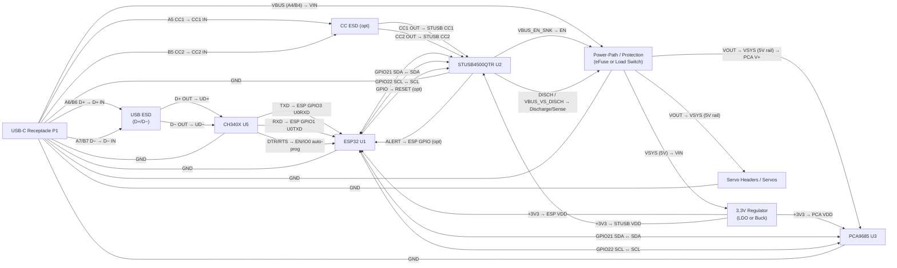

# USB-C PD Powered ESP32 Servo Controller

This document consolidates the **power architecture, wiring, BOM additions, and system diagram** for an ESP32-based robot arm controller using:

* **USB-C Power Delivery (PD)** via **STUSB4500QTR**
* **ESP32** MCU
* **PCA9685** PWM servo controller
* **CH340X** USB-to-UART programmer
* **Cheap / low-load servos** (budget-friendly design)

---

## 1. System Overview

The board negotiates a higher-voltage USB-C PD contract, then generates two isolated rails:

* **SERVO_6V** – high-current rail for servos
* **+3V3** – logic rail for ESP32, PCA9685, and STUSB4500

Key design goal: **prevent ESP32 brownout** caused by servo current spikes.

---

## 2. Power Domains

### Rails

* **VBUS_IN**: USB-C VBUS (5–20V after PD negotiation)
* **VSYS**: Post power-path rail
* **SERVO_6V**: Buck-regulated servo rail
* **+3V3**: Logic rail

### Critical Rules

* ESP32 **must only see 3.3V**
* Servo power **must not be drawn from 3.3V**
* Servo current must not share thin traces or return paths with ESP32 logic ground

---

## 3. Wiring Map (Net-Level)

### USB-C → STUSB4500QTR (PD)

* `USBC_CC1 (A5)  -> STUSB_CC1`
* `USBC_CC2 (B5)  -> STUSB_CC2`
* `USBC_VBUS      -> VBUS_IN`
* `USBC_GND       -> GND`

### USB-C → CH340X (USB2)

* `USBC_D+ (A6/B6 tied) -> CH340_UD+`
* `USBC_D− (A7/B7 tied) -> CH340_UD−`

### CH340X → ESP32 (UART)

* `CH340_TXD -> ESP32_U0RXD (GPIO3)`
* `CH340_RXD -> ESP32_U0TXD (GPIO1)`
* `CH340_DTR/RTS -> ESP32_EN / ESP32_IO0 (auto-program circuit)`

### ESP32 ↔ STUSB4500QTR (I2C + Status)

* `ESP32_GPIO21 (SDA) <-> STUSB_SDA` (pull-up to +3V3)
* `ESP32_GPIO22 (SCL) <-> STUSB_SCL` (pull-up to +3V3)
* `STUSB_ALERT -> ESP32_GPIO (input, optional)`
* `ESP32_GPIO -> STUSB_RESET (optional; otherwise pull-up)`

### ESP32 ↔ PCA9685 (I2C)

* `ESP32_GPIO21 (SDA) <-> PCA_SDA`
* `ESP32_GPIO22 (SCL) <-> PCA_SCL`
* `PCA_VDD -> +3V3`
* `PCA_V+  -> SERVO_6V`
* `PCA_GND -> GND`

### Power Chain

* `VBUS_IN -> Power Path -> VSYS`
* `VSYS -> Buck (6V) -> SERVO_6V`
* `VSYS -> Buck/LDO -> +3V3`

---

## 4. Layout Notes (Brownout Prevention)

* Route **SERVO_6V** with wide copper pours
* Return servo current directly to power entry ground (star-like topology)
* Place **bulk capacitors** close to servo headers
* Isolate logic rail with ferrite bead if needed

---

## 5. BOM Additions (Budget / Low-Load Servo Design)

### 5.1 Servo Rail Buck (VSYS → 6.0V)

**Recommended IC**

* **MP1584EN-LF-Z** – 3A buck regulator (cheap, common)

**Typical Supporting Parts**

* Inductor: 4.7µH, ≥3A shielded
* Input caps: 22–47µF MLCC
* Output caps: 2× 47µF MLCC + bulk electrolytic
* Feedback resistors: set to 6.0V

---

### 5.2 Logic Rail (VSYS → 3.3V)

**Option A (quieter, recommended)**

* Buck to 5V: **MP1584EN**
* LDO to 3.3V: **AP2112K-3.3TRG1** (600mA)

**Option B (fewer parts)**

* Single MP1584EN configured for 3.3V

---

### 5.3 USB Protection

* USB D+/D− ESD: **USBLC6-2SC6**
* CC line ESD (optional): **PESD5V0S1UL** (one per CC)

---

### 5.4 Ferrite Bead (Logic Isolation)

* **BLM21PG600SN1D** (0603)

---

### 5.5 Bulk Capacitors

**Servo Rail**

* 470µF – 2200µF electrolytic or polymer (≥10V)

**Logic Rail**

* 22µF bulk
* 0.1µF decoupling near ESP32 VDD

---

### 5.6 I2C Pull-ups

* SDA: 4.7kΩ to +3V3
* SCL: 4.7kΩ to +3V3

---

### 5.7 Optional Servo Signal Conditioning

* 33–100Ω series resistor on each PCA9685 PWM output

---

## 6. System Wiring Diagram (Mermaid)

---

## 7. Next Steps

Before PCB layout:

* Confirm **servo count** and **stall current**
* Decide PD voltage request (9V vs 12V)
* Lock in buck inductor + capacitor values per datasheet

Once confirmed, this design is **PCB-ready** for a low-cost, reliable USB-C powered robot arm controller.
